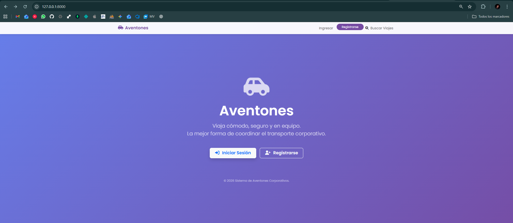

# Aventones - Aplicación de Viajes Compartidos

**Aventones** es una aplicación web robusta y moderna desarrollada con el framework Laravel. El objetivo principal de este proyecto es facilitar la conexión entre conductores que tienen asientos disponibles en sus vehículos y pasajeros que necesitan un viaje, promoviendo así el carpooling de una manera eficiente y segura.

## Acerca del Proyecto

Esta plataforma permite a los usuarios registrarse, publicar sus próximos viajes, buscar rutas disponibles y reservar asientos. El sistema está diseñado para ser intuitivo y fácil de usar, con un enfoque en la seguridad y la confianza entre los usuarios a través de perfiles y un sistema de calificaciones.

### Funcionalidades Principales (Ejemplo)

*   **Gestión de Usuarios:** Registro, inicio de sesión y perfiles de usuario personalizables.
*   **Publicación de Viajes:** Los conductores pueden publicar detalles de sus viajes, como origen, destino, fecha, hora, asientos disponibles y precio.
*   **Búsqueda y Reserva:** Los pasajeros pueden buscar viajes según sus necesidades y reservar un asiento de forma segura.
*   **Sistema de Notificaciones por Correo:** La aplicación envía correos electrónicos automáticos para mantener a los usuarios informados. Notifica al **conductor** cuando recibe nuevas solicitudes de reserva y alerta al **pasajero** cuando su reserva ha sido aceptada o cancelada.
*   **Perfiles y Calificaciones:** Sistema de calificación y reseñas para construir confianza dentro de la comunidad.
*   **Panel de Control:** Un dashboard para que los usuarios administren sus viajes publicados y sus reservas.


## Tecnologías Utilizadas

Este proyecto fue construido utilizando un stack de tecnologías moderno y eficiente.

### Backend
*   **PHP 8.2+**
*   **Laravel 12:** Como framework principal, aprovechando su ecosistema para ruteo, ORM (Eloquent), plantillas (Blade) y más.
*   **Monolog:** Para el manejo de logs.
*   **Guzzle:** Cliente HTTP para consumir APIs externas.

### Frontend
*   **HTML5 & CSS3**
*   **JavaScript**
*   **Blade:** Motor de plantillas de Laravel.

### Base de Datos
*   Laravel Eloquent ORM con soporte para **MySQL** 

### Entorno de Desarrollo y Herramientas
*   **Composer:** Manejador de dependencias para PHP.
*   **Laravel Sail:** Entorno de desarrollo local basado en Docker.
*   **PHPUnit:** Para pruebas unitarias y de integración.
*   **Laravel Pint:** Para formateo y estandarización del código.
*   **Artisan Console:** La interfaz de línea de comandos de Laravel.

### Galería de Capturas

Aquí puedes ver cómo luce la aplicación en funcionamiento:

#### Plataforma Web

| Página de Inicio | Búsqueda de Viajes |
|:----------------:|:------------------:|
|  |  |

| Publicar Viaje | Historial de Usuario |
|:--------------:|:--------------------:|
|  |  |

#### Notificaciones por Correo

| Aviso de Nuevo Ride (Conductor) | Confirmación de Reserva (Pasajero) |
|:-------------------------------:|:----------------------------------:|
|  |  |

## Instalación y Ejecución

Sigue estos pasos para configurar y correr el proyecto en tu entorno local:

1.  Clonar el repositorio: `git clone https://github.com/tu-usuario/Aventones_Laravel.git`
2.  Instalar dependencias de PHP:
    ```bash
    composer install
    ```
3.  Configurar el entorno:
    - Copia el archivo de ejemplo: `cp .env.example .env`
    - Abre el archivo `.env` y configura tus credenciales de base de datos (MySQL).
    - **Importante:** Crea una base de datos vacía en **phpMyAdmin** con el nombre que pusiste en `DB_DATABASE` (ej: `aventones`).
    - Genera la clave de la aplicación: 
      ```bash
      php artisan key:generate
      ```
4.  Ejecutar las migraciones (y seeders si es necesario):
    ```bash
    php artisan migrate --seed
    ```
5.  Compilar estilos (Frontend):
    *Aunque el servidor corre con PHP, necesitamos NPM para generar los archivos CSS y JS optimizados.*
    ```bash
    npm install && npm run build
    ```
6.  Iniciar el servidor local:
    ```bash
    php artisan serve
    ```
    Ahora puedes acceder a la aplicación en tu navegador: http://localhost:8000

## Autor

**Alvaro Victor Zamora**
- 📱 Teléfono: +506 8722-1109
- 📧 Correo: alvarovictor06@gmail.com
- 🐙 GitHub: alvi014

## License

Este proyecto está bajo la Licencia MIT.
